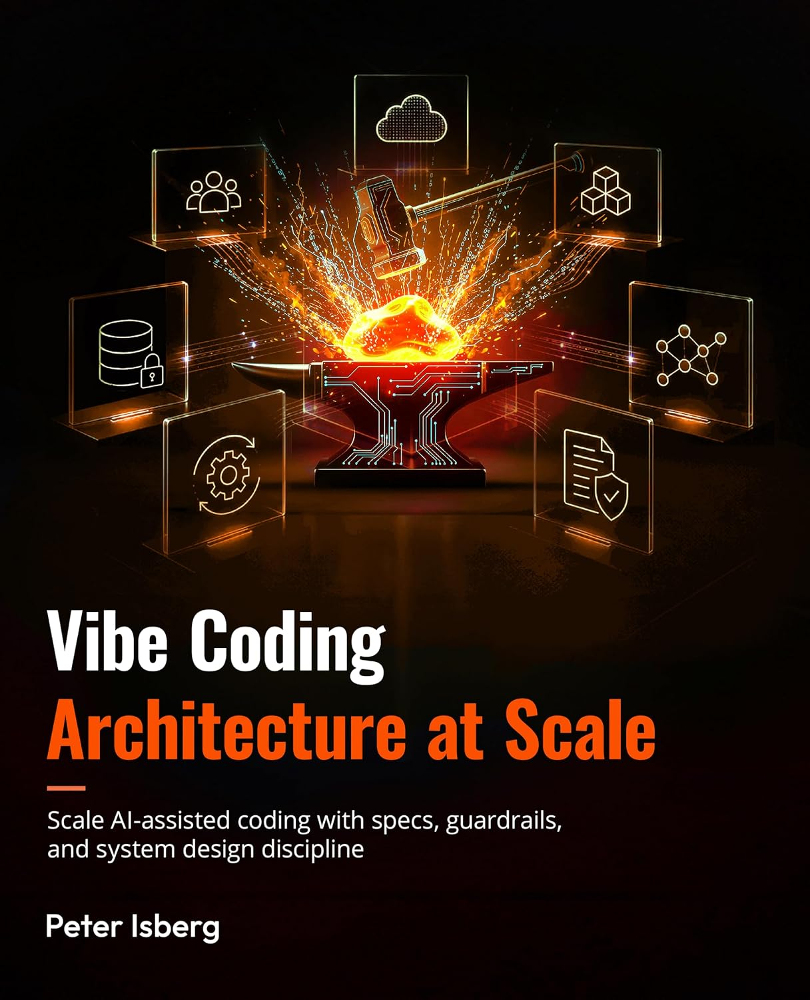

## About

I am a software developer in Gothenburg, Sweden, working mostly in Java. My open source work
keeps returning to one question: when AI agents write most of the code, what keeps the system
correct?

My answers so far are annotations that fence off the code an agent must not touch, tests that
force concurrency bugs to reproduce on demand, a local firewall against prompt injection, and
a book about the architecture that holds it all together.

Ask me about Java, AI guardrails, static analysis, MCP servers, and why a green test suite is
not proof.

## The book

<table>
<tr>
<td width="250" align="center">

</td>
<td>

### Vibe Coding Architecture at Scale

**Vibe coding gives you speed. Vibe Architecture gives you scale.**

When syntax is free, structure is your only asset. This is the book on designing, scaling and
guardrailing large-scale systems in the age of AI orchestration.

</td>
</tr>
</table>

## Open source

<table>
<tr><th align="left" width="170">Project</th><th align="left">What it does</th><th align="left" width="80">Stars</th></tr>
<tr><td colspan="3"><b>Guardrails for AI agents</b></td></tr>
<tr>
<td><a href="https://github.com/PIsberg/vibetags"><b>vibetags</b></a></td>
<td>Java annotations as AI guardrails. Mark the code an agent must not rewrite, and it stops rewriting it.</td>
<td></td>
</tr>
<tr>
<td><a href="https://github.com/PIsberg/llm-fw"><b>llm-fw</b></a></td>
<td>Local prompt injection firewall. Malicious prompts are blocked and logged, clean ones pass through.</td>
<td></td>
</tr>
<tr>
<td><a href="https://github.com/PIsberg/axiom"><b>axiom</b></a></td>
<td>The codebase as a live queryable graph, so an agent can see what it just broke.</td>
<td></td>
</tr>
<tr>
<td><a href="https://github.com/PIsberg/skill3"><b>skill3</b></a></td>
<td>Relearns a technical skill for an agent, anchored to a target model cutoff, and vets the result.</td>
<td></td>
</tr>
<tr>
<td><a href="https://github.com/PIsberg/ghost-mcp"><b>ghost-mcp</b></a></td>
<td>MCP server that exposes OS level UI automation to AI clients.</td>
<td></td>
</tr>
<tr><td colspan="3"><b>Java correctness and analysis</b></td></tr>
<tr>
<td><a href="https://github.com/PIsberg/async-test-lib"><b>async-test-lib</b></a></td>
<td>Forces concurrency bugs to happen using synchronized barriers, then names the one that fired.</td>
<td></td>
</tr>
<tr>
<td><a href="https://github.com/PIsberg/codekoll"><b>codekoll</b></a></td>
<td>Static analyzer for Java that finds the bugs which compile perfectly and detonate in production.</td>
<td></td>
</tr>
<tr>
<td><a href="https://github.com/PIsberg/codekarta"><b>codekarta</b></a></td>
<td>Parses Java source and emits SVG maps: call graphs, exception flow, state machines.</td>
<td></td>
</tr>
<tr>
<td><a href="https://github.com/PIsberg/blindbean"><b>blindbean</b></a></td>
<td>Homomorphic encryption hidden behind ordinary Java objects and annotations.</td>
<td></td>
</tr>
</table>

## Toolbox

<table>
<tr>
<td><b>Primary</b></td>
<td>

</td>
</tr>
<tr>
<td><b>Also fluent</b></td>
<td>

</td>
</tr>
<tr>
<td><b>Platform and AI</b></td>
<td>

</td>
</tr>
</table>

## Activity

<picture>
<source media="(prefers-color-scheme: dark)" srcset="https://github-profile-summary-cards.vercel.app/api/cards/stats?username=PIsberg&theme=github_dark" />

</picture>
<picture>
<source media="(prefers-color-scheme: dark)" srcset="https://github-profile-summary-cards.vercel.app/api/cards/repos-per-language?username=PIsberg&theme=github_dark" />

</picture>

---

Get in touch: <a href="mailto:isberg.peter@gmail.com">isberg.peter@gmail.com</a> · <a href="http://www.deversity.se">deversity.se</a>

