<!--
  Every image under assets/cards and assets/ui is generated: edit the tables in
  tools/gen_assets.py and run `python tools/gen_assets.py`. Only assets/banner.svg is hand-drawn.
-->

I am a software developer in Gothenburg, Sweden, working mostly in Java. My open source work
keeps returning to one question: when AI agents write most of the code, what keeps the system
correct?

My answers so far are annotations that fence off the code an agent must not touch, tests that
force concurrency bugs to reproduce on demand, a local firewall against prompt injection, and
a book about the architecture that holds it all together.

Ask me about Java, AI guardrails, static analysis, MCP servers, and why a green test suite is
not proof.

<a href="https://www.amazon.com/Vibe-Coding-Architecture-Scale-AI-assisted-ebook/dp/B0HF3MLBB8">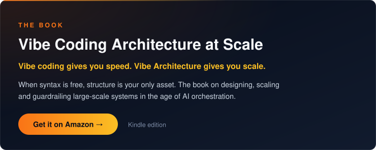</a>

Eight of these projects are stations on one line: the path a change takes from an AI agent to
production.


### Guardrails for AI agents

<a href="https://github.com/PIsberg/vibetags">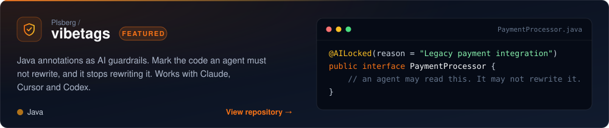</a>
<a href="https://github.com/PIsberg/llm-fw">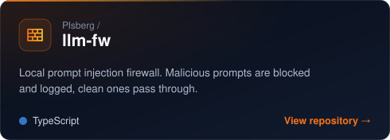</a>
<a href="https://github.com/PIsberg/axiom">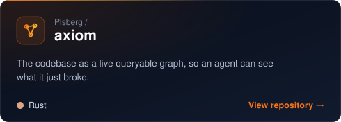</a>
<a href="https://github.com/PIsberg/skill3">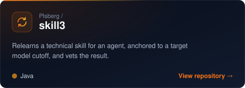</a>
<a href="https://github.com/PIsberg/ghost-mcp">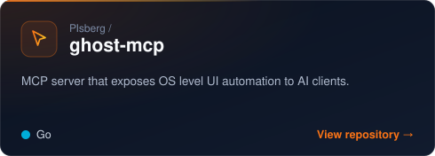</a>

### Java correctness and analysis

<a href="https://github.com/PIsberg/async-test-lib">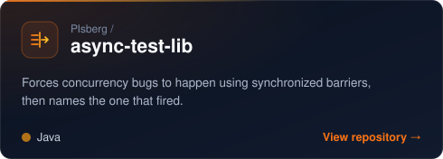</a>
<a href="https://github.com/PIsberg/codekoll">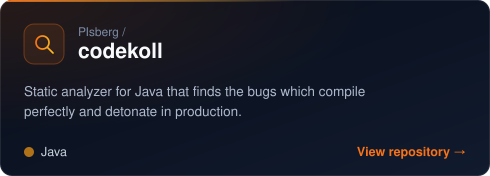</a>
<a href="https://github.com/PIsberg/codekarta">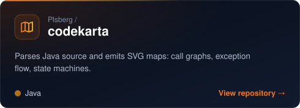</a>
<a href="https://github.com/PIsberg/blindbean">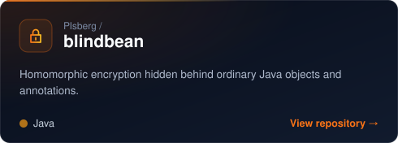</a>

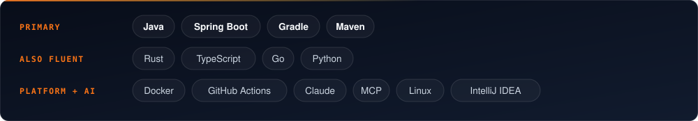

<picture>
<source media="(prefers-color-scheme: dark)" srcset="https://github-profile-summary-cards.vercel.app/api/cards/stats?username=PIsberg&theme=github_dark" />

</picture>
<picture>
<source media="(prefers-color-scheme: dark)" srcset="https://github-profile-summary-cards.vercel.app/api/cards/repos-per-language?username=PIsberg&theme=github_dark" />

</picture>

 

<a href="mailto:isberg.peter@gmail.com">isberg.peter@gmail.com</a> · <a href="http://www.deversity.se">deversity.se</a>

