<div align="center">



<b>Developer by profession. Vibecoding after hours.</b>

<p>
<a href="http://www.deversity.se"></a>
<a href="mailto:isberg.peter@gmail.com"></a>
<a href="https://github.com/PIsberg?tab=followers"></a>

</p>

</div>

```console
> ./t800 --status
+==============================================================+
|  CYBERDYNE SYSTEMS MODEL 101   ::   VISUAL CORTEX ONLINE     |
+==============================================================+
|  TARGET .......... AI guardrails, concurrency bugs,          |
|                    static analysis, MCP tooling              |
|  PRIMARY WEAPON .. Java 25/26       SIDEARM ... Rust, TS, Go |
|  BASE ............ Gothenburg, SE   ORG ....... Deversity AB |
|  MISSION LOG ..... 35 public repos, and counting             |
|  DIRECTIVE ....... Star a repo or two if you like them.      |
+==============================================================+
> _
```


### `>> MISSION_PARAMETERS`

- **`ACTIVE`** Building **[vibetags](https://github.com/PIsberg/vibetags)**, Java annotations that tell Claude, Cursor and Codex which code they are not allowed to touch
- **`LAB`** Making concurrency bugs reproducible instead of lucky with **[async-test-lib](https://github.com/PIsberg/async-test-lib)**
- **`SHIELD`** Running a local **[prompt injection firewall](https://github.com/PIsberg/llm-fw)** between my tools and every LLM API
- **`UPLINK`** Ask me about Java, AI guardrails, static analysis, MCP servers, and why a green test suite is not proof
- **`COMMS`** Reach me at [isberg.peter@gmail.com](mailto:isberg.peter@gmail.com) or [deversity.se](http://www.deversity.se)


### `>> WEAPONS_SYSTEMS`

<table>
<tr>
<td align="right"><code>PRIMARY</code></td>
<td>


</td>
</tr>
<tr>
<td align="right"><code>SIDEARMS</code></td>
<td>


</td>
</tr>
<tr>
<td align="right"><code>SUPPORT</code></td>
<td>


</td>
</tr>
</table>


### `>> PRIMARY_TARGETS`

<table>
<tr><th align="left">Repo</th><th align="left">Stars</th><th align="left">What it does</th></tr>
<tr>
<td><a href="https://github.com/PIsberg/vibetags"><b>vibetags</b></a></td>
<td></td>
<td>Java annotations as AI guardrails. Mark the code an agent must not rewrite, and it stops rewriting it.</td>
</tr>
<tr>
<td><a href="https://github.com/PIsberg/async-test-lib"><b>async-test-lib</b></a></td>
<td></td>
<td>Forces concurrency bugs to happen using synchronized barriers, then names the one that fired.</td>
</tr>
<tr>
<td><a href="https://github.com/PIsberg/llm-fw"><b>llm-fw</b></a></td>
<td></td>
<td>Local prompt injection firewall. Malicious prompts are blocked and logged, clean ones pass through.</td>
</tr>
<tr>
<td><a href="https://github.com/PIsberg/skill3"><b>skill3</b></a></td>
<td></td>
<td>Relearns a technical skill for an agent, anchored to a target model cutoff, and vets the result.</td>
</tr>
<tr>
<td><a href="https://github.com/PIsberg/codekoll"><b>codekoll</b></a></td>
<td></td>
<td>Static analyzer for Java that finds the bugs which compile perfectly and detonate in production.</td>
</tr>
<tr>
<td><a href="https://github.com/PIsberg/codekarta"><b>codekarta</b></a></td>
<td></td>
<td>Parses Java source and emits SVG maps: call graphs, exception flow, state machines.</td>
</tr>
<tr>
<td><a href="https://github.com/PIsberg/axiom"><b>axiom</b></a></td>
<td></td>
<td>The codebase as a live queryable graph, so an agent can see what it just broke.</td>
</tr>
<tr>
<td><a href="https://github.com/PIsberg/blindbean"><b>blindbean</b></a></td>
<td></td>
<td>Homomorphic encryption hidden behind ordinary Java objects and annotations.</td>
</tr>
<tr>
<td><a href="https://github.com/PIsberg/ghost-mcp"><b>ghost-mcp</b></a></td>
<td></td>
<td>MCP server that exposes OS level UI automation to AI clients.</td>
</tr>
</table>


### `>> COMBAT_TELEMETRY`

<div align="center">


</div>

<!--
  github-readme-stats cards in the same fire palette. The public instance at
  github-readme-stats.vercel.app returned DEPLOYMENT_PAUSED when this README was written,
  so they are parked here. Self-host the fork on Vercel, replace HOST below, and uncomment.

  
  
  
-->

<div align="center">

*Come with me if you want to ship.*



</div>